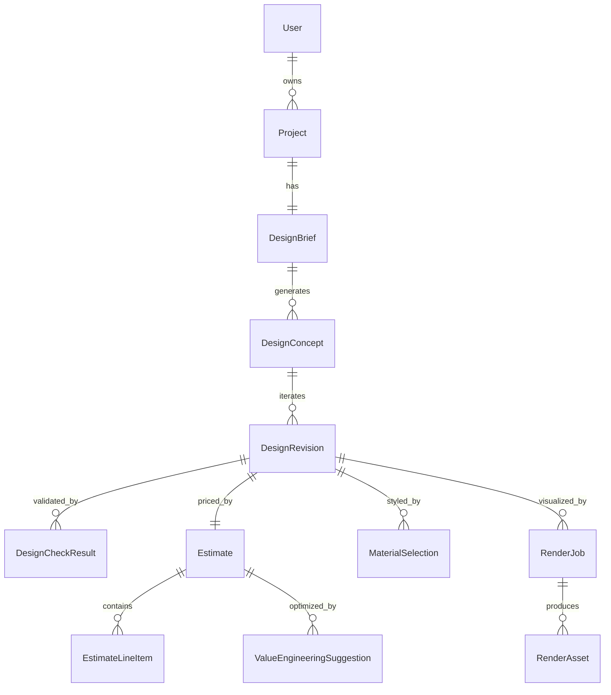

# BuildSphere MVP — Phase 1 Scope

Phase 1 from the [Platform Overview](PLATFORM_OVERVIEW.md): **AI Design · Floor Plans · 3D Rendering · Walkthroughs · Budget · Material Takeoff.**

The MVP proves one loop: *a homeowner describes the home they want, sees credible concepts with honest prices, and iterates until they love one.* Everything else (professionals, permits, construction) hangs off that loop in later phases.

## In scope

1. **Accounts & projects** — email/password auth, a homeowner creates a project (name, location, lot dimensions entered manually — LandSphere integration is Phase 3).
2. **Design interview** (DesignSphere) — program, style, and interior-preference questionnaire producing a versioned `DesignBrief`.
3. **AI concept generation** — N floor-plan concepts per brief as a parametric model (rooms, walls, openings) + elevations metadata; every concept carries a **Design Health Score** from the automated checks.
4. **Iteration** — natural-language revision requests ("bigger kitchen, add a mudroom") create new `DesignRevision`s; checks and pricing re-run each time.
5. **Visualization** (ModelSphere) — fast previews inline; queued photorealistic stills and 360° room panoramas; web walkthrough. Rendering credits metered per tier.
6. **Budget & takeoff** (CostSphere) — every revision gets a material takeoff and an `Estimate` with line items and a confidence range; budget-vs-estimate delta always visible; basic value-engineering suggestions when over budget.
7. **Phase 2 seam** — a "Request professional review" CTA that captures intent (waitlist) without the EngineerSphere workflow behind it yet.

## Out of scope (and where it lands)

| Deferred | Phase |
| --- | --- |
| LandSphere site intelligence | 3 |
| Professional portal, review, approvals | 2 |
| Marketplace | 2 |
| Permitting | 3 |
| Construction management | 4 |
| HomeTwin | 5 |
| VR/AR, drone flyover, sun/season simulation | 1.x–2 |

## Core data model (MVP)



Key columns (PostgreSQL; all tables get `id uuid pk`, `created_at`, `updated_at`):

- **users** — email, password_hash, display_name, role (`homeowner` now; enum grows in Phase 2), subscription_tier
- **projects** — owner_id, name, address_text, lot_width_ft, lot_depth_ft, budget_cents, status
- **design_briefs** — project_id, version, answers `jsonb` (program/style/interiors), superseded_by
- **design_concepts** — brief_id, label, model `jsonb` (parametric: rooms, walls, openings, levels), style, sqft, beds, baths
- **design_revisions** — concept_id, parent_revision_id, model `jsonb`, change_summary, health_score
- **design_check_results** — revision_id, check_key, status (`pass|warn|fail`), detail, location `jsonb`
- **estimates** — revision_id, total_cents, low_cents, high_cents, region_code
- **estimate_line_items** — estimate_id, category, description, qty numeric, unit, unit_cost_cents, source (`takeoff|allowance`)
- **material_selections** — revision_id, surface, room_key, product_ref, unit_cost_cents
- **render_jobs** — revision_id, kind (`preview|still|pano360|walkthrough`), status, credits, error
- **render_assets** — job_id, url, kind, width, height, meta `jsonb`
- **ve_suggestions** — estimate_id, description, savings_cents, design_impact (`low|med|high`), status

The parametric model living in `jsonb` is deliberate for MVP speed; it graduates to first-class geometry storage when BIM/IFC arrives in Phase 2.

## API sketch (REST, `/api/v1`)

Auth: bearer session token. All routes scoped to the authenticated owner.

```
POST   /auth/signup | /auth/login | /auth/logout

GET    /projects                      list my projects
POST   /projects                      create
GET    /projects/:id                  detail (brief, active concept, budget delta)

PUT    /projects/:id/brief            save/replace interview answers (new version)
POST   /projects/:id/concepts:generate  run generation        → 202 + job
GET    /projects/:id/concepts         list concepts w/ scores + estimate totals

POST   /concepts/:id/revisions        natural-language revision request → 202 + job
GET    /revisions/:id                 model + checks + estimate
GET    /revisions/:id/checks          health-check detail

GET    /revisions/:id/estimate        line items, range, budget delta
POST   /estimates/:id/ve:apply        accept a value-engineering suggestion → new revision

POST   /revisions/:id/renders         create render job {kind}
GET    /renders/:id                   job status + assets

POST   /projects/:id/review-request   Phase-2 seam: capture professional-review intent
GET    /health                        liveness + config presence (no secrets)
```

Long-running work (generation, revision, rendering) is **202 + job polling** (`GET /jobs/:id`) from day one — the render farm and design engine are asynchronous by nature.

## AI boundaries (MVP)

- Conversational assistance and design generation use hosted LLM APIs; the parametric model and all **checks, takeoffs, and estimates are deterministic code** — the AI proposes, engines validate and price. (Same discipline as the safety split: model output never overrides deterministic guardrails.)
- Every AI-generated concept is labeled *concept — not construction documents*.

## MVP success metrics (from platform KPIs)

- User onboarding completion rate (interview finish rate)
- AI-generated concepts accepted (≥1 favorited concept per project)
- Estimate confidence-range honesty (tracked from day one, judged in Phase 4 against actuals)
- Subscription retention / rendering-credit consumption
